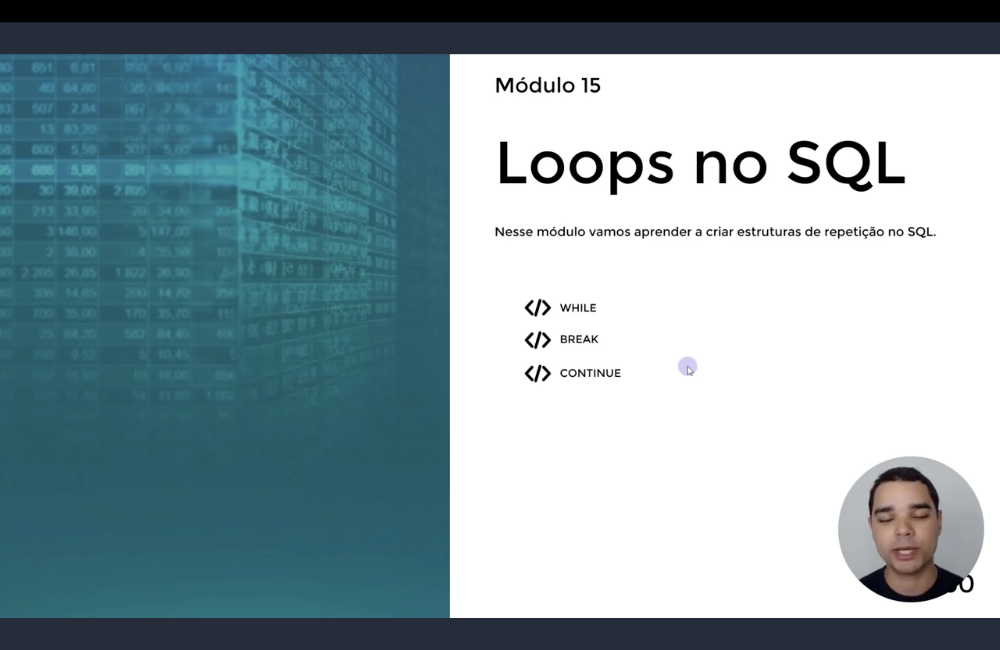
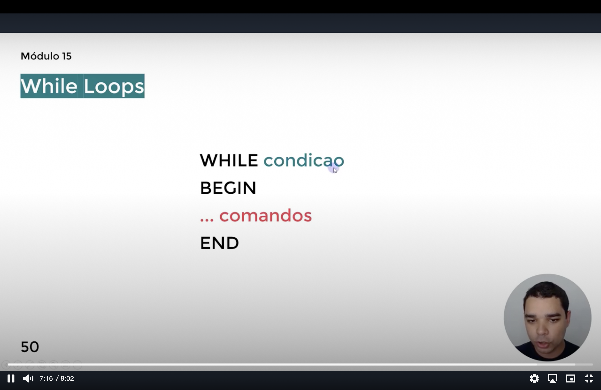
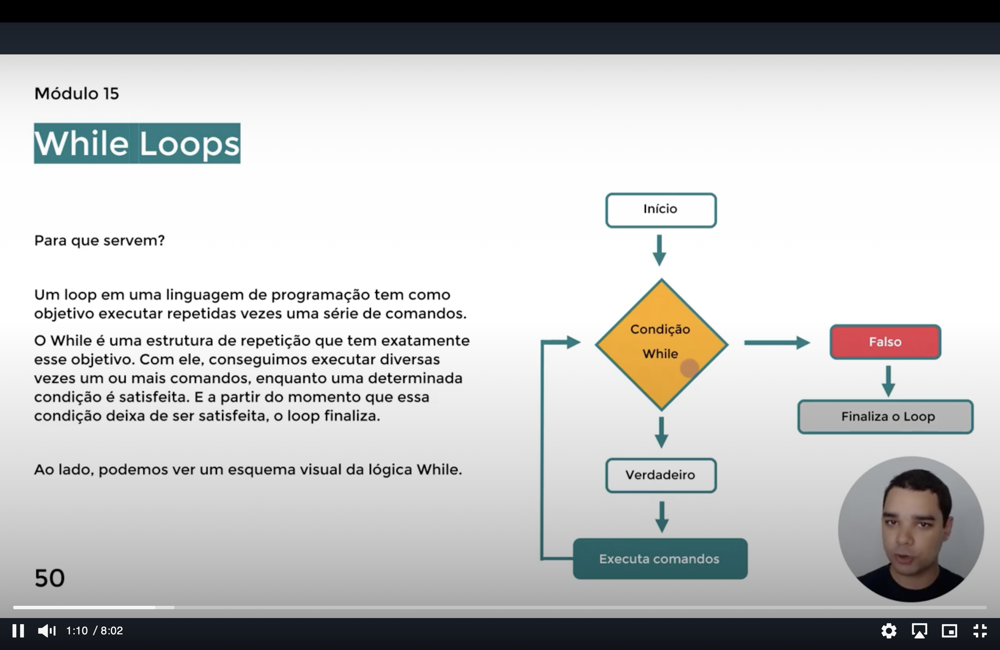
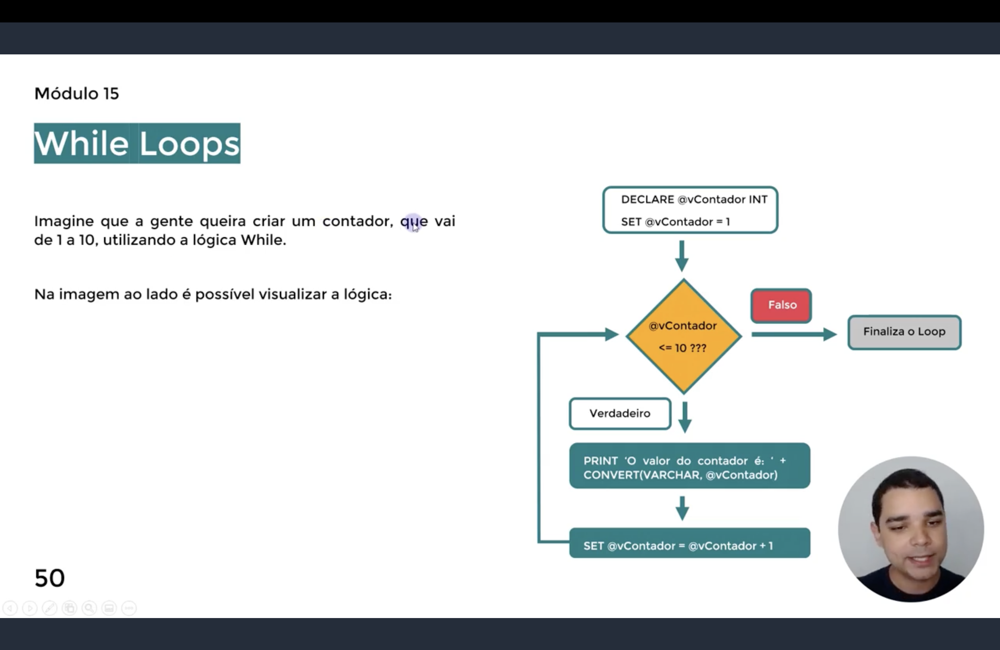

<h1 align="center">
  🔁 Loops no SQL — WHILE <br>
  
</h1>

<p align="center">
  
  
  
</p>

<p align="center">
  
</p>

<p align="center">
  <em>Slide de abertura do módulo: as três palavras-chave que formam a estrutura de repetição —
  <code>WHILE</code>, <code>BREAK</code> e <code>CONTINUE</code>.</em>
</p>

<h2 align="center">💡 Para que serve um Loop? <br>
</h2>

<p align="center">
  Um <strong>loop</strong> tem como objetivo executar repetidas vezes uma série de comandos.<br>
  O <strong>WHILE</strong> repete o bloco enquanto uma condição é satisfeita — a partir do momento
  que essa condição deixa de ser verdadeira, o loop é encerrado.
</p>

**Sintaxe básica:**

```sql
WHILE condição
BEGIN
    ... comandos
END
```

<p align="center">
  
</p>

<p align="center">
  <em>A sintaxe reduzida ao essencial: a condição fica ao lado do <code>WHILE</code>, e tudo o que
  deve se repetir vai entre o <code>BEGIN</code> e o <code>END</code>.</em>
</p>

<h2 align="center">🔄 Fluxo do WHILE <br>
</h2>

<p align="center">
  Um <strong>loop</strong> em uma linguagem de programação existe para executar repetidas vezes uma
  série de comandos. O <code>WHILE</code> testa a condição, executa o bloco enquanto ela for
  verdadeira e finaliza assim que ela se torna falsa.
</p>

```
       Início 🕹️
         │
         ▼
 ┌───────────────┐        Falso
 │  Condição     ├───────────────▶ Finaliza o Loop ❌
 │  WHILE 🔄     │
 └───────┬───────┘
         │ Verdadeiro✅
         ▼
 ┌───────────────┐
 │ Executa       │
 │ comandos🕹️    │
 └───────┬───────┘
         │
         └────────▶ (volta para a Condição🔄)
```

<p align="center">
  
</p>

<p align="center">
  <em>O mesmo fluxo em slide: <strong>Início → Condição WHILE →</strong> se <strong>Verdadeiro</strong>,
  executa os comandos e volta para a condição; se <strong>Falso</strong>, finaliza o loop.</em>
</p>

<h2 align="center">🟢 Contador simples <br>
</h2>

<p align="center">
  Um contador é declarado e incrementado a cada volta do loop, até deixar de satisfazer a condição.
</p>

**Exemplo:** contar de 1 até 10.

```sql
DECLARE @vContador INT
SET @vContador = 1

WHILE @vContador <= 10
BEGIN
    PRINT 'O valor do contador é: ' + CONVERT(VARCHAR, @vContador)
    SET @vContador = @vContador + 1
END
```

<p align="center">
  
</p>

<p align="center">
  <em>Fluxograma do exemplo: <code>DECLARE</code> e <code>SET</code> inicializam <code>@vContador = 1</code>;
  enquanto <code>@vContador <= 10</code> for <strong>Verdadeiro</strong>, o <code>PRINT</code> roda e o
  <code>SET @vContador = @vContador + 1</code> incrementa antes de voltar a testar a condição;
  quando ela vira <strong>Falso</strong>, o loop finaliza.</em>
</p>

> ⚠️ Sem incrementar a variável de controle (`SET @vContador = @vContador + 1`), a condição nunca
> deixa de ser verdadeira e o loop se torna **infinito**.

<h2 align="center">🔴 BREAK — encerrando o loop <br>
</h2>

<p align="center">
  O <code>BREAK</code> interrompe o loop imediatamente, mesmo que a condição do <code>WHILE</code>
  ainda seja verdadeira.
</p>

```sql
DECLARE @vContador INT
SET @vContador = 1

WHILE @vContador <= 100
BEGIN
    PRINT 'O valor do contador é: ' + CONVERT(VARCHAR, @vContador)
    IF @vContador = 15
        BREAK
    SET @vContador = @vContador + 1
END
```

> 📌 O contador iria de 1 até 100, mas o `BREAK` encerra o loop assim que `@vContador` chega a 15.

<h2 align="center">🟡 CONTINUE — pulando uma iteração <br>
</h2>

<p align="center">
  O <code>CONTINUE</code> pula o restante do bloco e volta direto para a verificação da condição do
  <code>WHILE</code>.
</p>

```sql
DECLARE @varContador INT
SET @varContador = 0

WHILE @varContador <= 10
BEGIN
    SET @varContador += 1
    IF @varContador = 3 OR @varContador = 6
        CONTINUE
    PRINT @varContador
END
```

> 📌 Os números `3` e `6` nunca são impressos — o `CONTINUE` retorna ao topo do loop antes que o
> `PRINT` seja executado para eles.

<h2 align="center">📋 Resumo <br>
</h2>

| Palavra-chave | O que faz |
|----------------|-----------|
| `WHILE condição` | Repete o bloco enquanto a condição for verdadeira |
| `BREAK` | Encerra o loop imediatamente |
| `CONTINUE` | Pula para a próxima verificação da condição, ignorando o restante do bloco |

<h2 align="center">🗄️ Aulas do Módulo <br>
</h2>

| Arquivo SQL | Aula | Tópico |
|-------------|------|--------|
| `123` | Aula 1 | WHILE — Exercícios 5 a 8 (contador, loop infinito, BREAK, CONTINUE) |