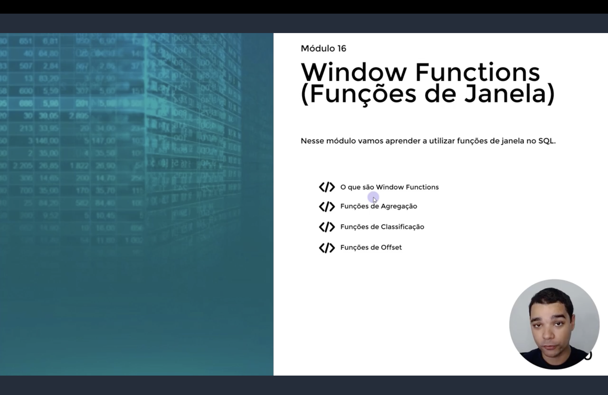
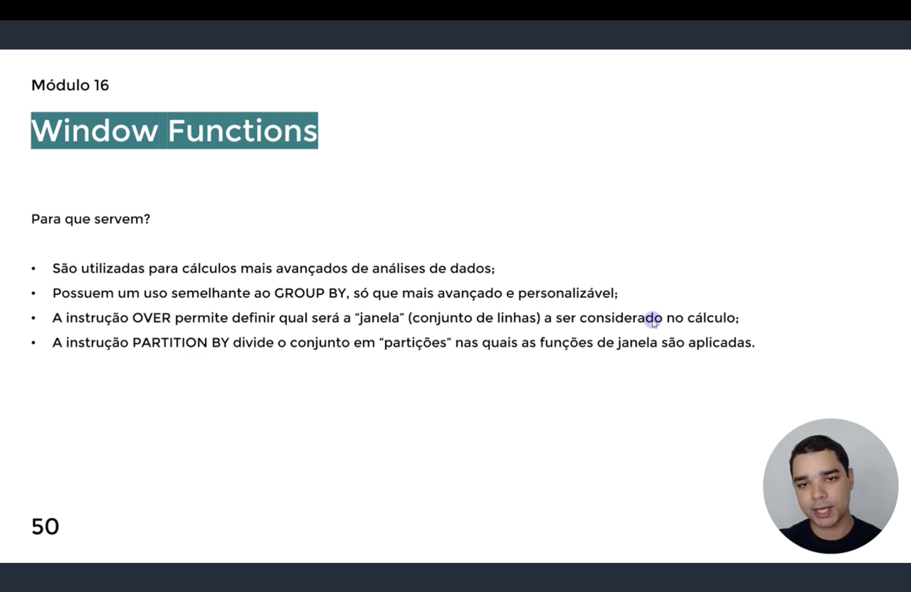
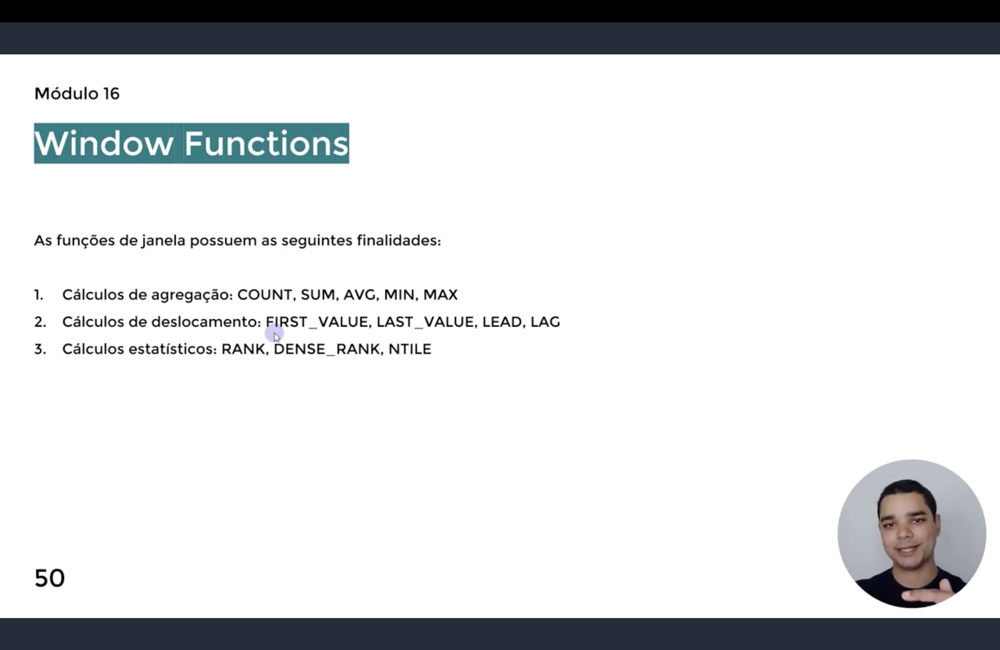
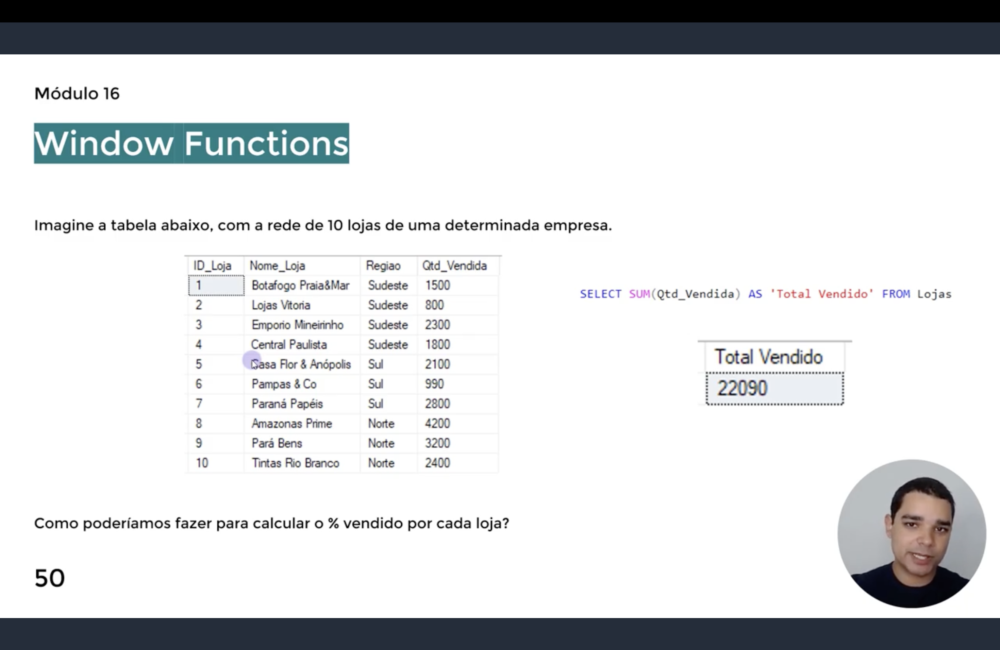
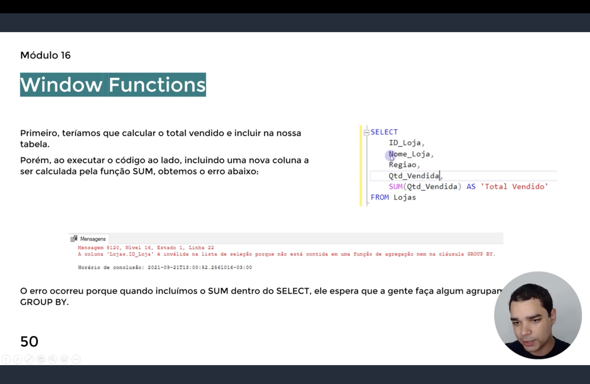
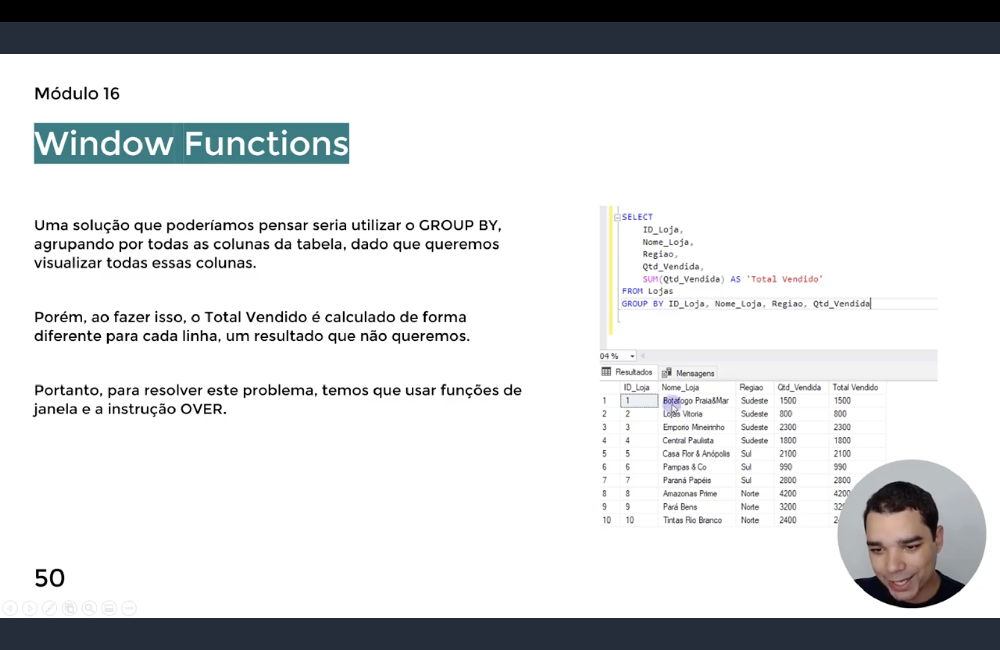
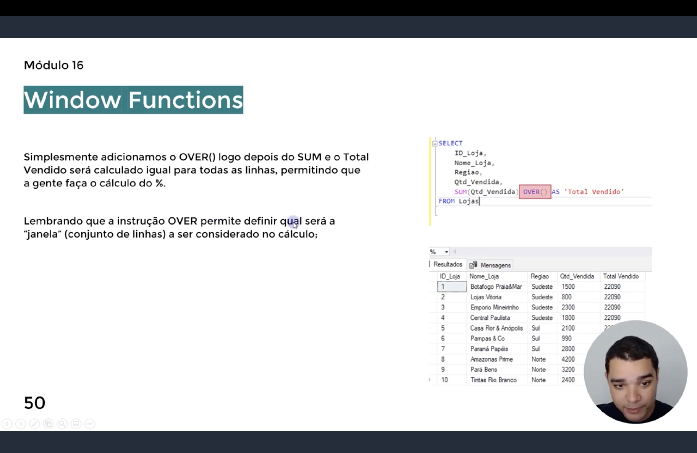
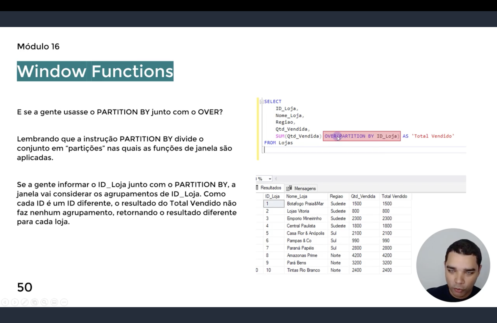
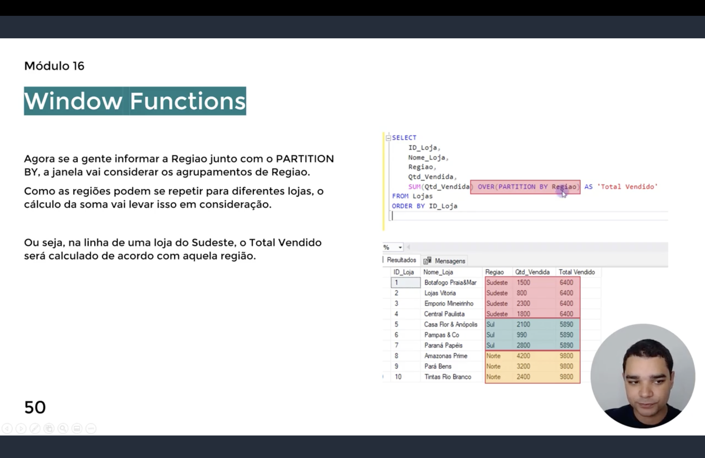

<h1 align="center">
  🪟 Window Functions — Funções de Janela <br>
  
</h1>

<p align="center">
  
  
  
</p>

> 📌 Nos slides de abertura o instrutor numera este conteúdo como **"Módulo 16"**, mas ele corresponde
> à pasta `Módulo 15` deste repositório — a numeração interna do curso está um módulo à frente da
> organização das pastas.

<p align="center">
  
</p>

<p align="center">
  <em>Slide de abertura do módulo: <strong>Window Functions (Funções de Janela)</strong>. O objetivo é
  aprender a utilizar funções de janela no SQL, cobrindo quatro frentes — o que são Window Functions,
  Funções de Agregação, Funções de Classificação e Funções de Offset.</em>
</p>

<h2 align="center">💡 O que são Window Functions? <br>
</h2>

<p align="center">
  
</p>

**Para que servem:**

- São utilizadas para **cálculos mais avançados de análises de dados**;
- Possuem um uso semelhante ao `GROUP BY`, só que **mais avançado e personalizável**;
- A instrução **`OVER`** permite definir qual será a **"janela"** (conjunto de linhas) a ser
  considerado no cálculo;
- A instrução **`PARTITION BY`** divide o conjunto em **"partições"** nas quais as funções de janela
  são aplicadas.

> 💬 Ou seja: diferente do `GROUP BY`, que colapsa as linhas em um resultado por grupo, a `OVER()`
> calcula o valor "de janela" e **devolve o resultado em todas as linhas originais**, sem reduzir a
> quantidade de linhas do resultado.

<h2 align="center">🧩 As três finalidades das Window Functions <br>
</h2>

<p align="center">
  
</p>

| # | Categoria | Funções | O que fazem |
|---|-----------|---------|--------------|
| 1 | **Cálculos de agregação** | `COUNT`, `SUM`, `AVG`, `MIN`, `MAX` | As mesmas funções agregadoras do `GROUP BY`, mas aplicadas "na janela", preservando todas as linhas |
| 2 | **Cálculos de deslocamento** | `FIRST_VALUE`, `LAST_VALUE`, `LEAD`, `LAG` | Trazem valores de outras linhas (primeira, última, anterior, próxima) para a linha atual |
| 3 | **Cálculos estatísticos** | `RANK`, `DENSE_RANK`, `NTILE` | Classificam ou distribuem as linhas dentro da janela |

<h2 align="center">🏬 Problema de exemplo: rede de 10 lojas <br>
</h2>

<p align="center">
  
</p>

<p align="center">
  <em>Tabela <code>Lojas</code> com 10 lojas, cada uma com <code>ID_Loja</code>, <code>Nome_Loja</code>,
  <code>Regiao</code> e <code>Qtd_Vendida</code>. Pergunta motivadora: <strong>como calcular o % vendido
  por cada loja?</strong></em>
</p>

O primeiro passo para responder essa pergunta é calcular o **total vendido** pela rede inteira:

```sql
SELECT SUM(Qtd_Vendida) AS 'Total Vendido' FROM Lojas
```

Isso retorna um único valor (`22090`) — mas ele está isolado, fora da tabela original. Para calcular o
percentual de cada loja, seria necessário ter esse total **ao lado de cada linha**.

<h3 align="center">❌ Tentativa 1 — SUM direto no SELECT</h3>

<p align="center">
  
</p>

```sql
SELECT
    ID_Loja,
    Nome_Loja,
    Regiao,
    Qtd_Vendida,
    SUM(Qtd_Vendida) AS 'Total Vendido'
FROM Lojas
```

Isso gera o erro:

```
Mensagem 8120, Nível 16, Estado 1, Linha 22
A coluna 'Lojas.ID_Loja' é inválida na lista de seleção porque não está
contida em uma função de agregação nem na cláusula GROUP BY.
```

> ⚠️ O erro ocorre porque, ao incluir o `SUM` dentro do `SELECT` junto de colunas não agregadas, o SQL
> Server espera que a gente faça algum agrupamento com `GROUP BY`.

<h3 align="center">❌ Tentativa 2 — GROUP BY em todas as colunas</h3>

<p align="center">
  
</p>

```sql
SELECT
    ID_Loja,
    Nome_Loja,
    Regiao,
    Qtd_Vendida,
    SUM(Qtd_Vendida) AS 'Total Vendido'
FROM Lojas
GROUP BY ID_Loja, Nome_Loja, Regiao, Qtd_Vendida
```

Uma solução possível seria agrupar por **todas** as colunas da tabela, já que queremos exibi-las
todas. Porém, ao fazer isso, o `Total Vendido` é calculado **de forma diferente para cada linha**
(cada grupo vira uma única loja) — o resultado simplesmente repete o `Qtd_Vendida` de cada linha, e
não o total da rede. Não é o que queremos.

> 📌 Para resolver esse problema de fato, precisamos usar **funções de janela** com a instrução
> `OVER`.

<h2 align="center">✅ A solução: OVER() <br>
</h2>

<p align="center">
  
</p>

```sql
SELECT
    ID_Loja,
    Nome_Loja,
    Regiao,
    Qtd_Vendida,
    SUM(Qtd_Vendida) OVER() AS 'Total Vendido'
FROM Lojas
```

Basta adicionar `OVER()` logo depois do `SUM`. Com isso, o `Total Vendido` é calculado **igual para
todas as linhas** (`22090`), sem precisar de `GROUP BY` e sem perder nenhuma coluna — o que agora
permite calcular o percentual de cada loja em relação ao total.

> 💡 A instrução `OVER` permite definir qual será a "janela" (conjunto de linhas) a ser considerado no
> cálculo. Com `OVER()` vazio, a janela é **a tabela inteira**.

<h2 align="center">🔀 PARTITION BY — janelas por grupo <br>
</h2>

E se a gente usasse o `PARTITION BY` junto com o `OVER`? Lembrando que a instrução `PARTITION BY`
divide o conjunto em **"partições"**, nas quais as funções de janela são aplicadas.

<h3 align="center">Partição por ID_Loja</h3>

<p align="center">
  
</p>

```sql
SELECT
    ID_Loja,
    Nome_Loja,
    Regiao,
    Qtd_Vendida,
    SUM(Qtd_Vendida) OVER(PARTITION BY ID_Loja) AS 'Total Vendido'
FROM Lojas
```

Se informarmos `ID_Loja` no `PARTITION BY`, a janela passa a considerar os agrupamentos de
`ID_Loja`. Como cada `ID_Loja` é único, cada partição tem **uma única linha**, então o `Total Vendido`
não faz nenhum agrupamento de fato — o resultado simplesmente repete o `Qtd_Vendida` de cada loja.

<h3 align="center">Partição por Regiao</h3>

<p align="center">
  
</p>

```sql
SELECT
    ID_Loja,
    Nome_Loja,
    Regiao,
    Qtd_Vendida,
    SUM(Qtd_Vendida) OVER(PARTITION BY Regiao) AS 'Total Vendido'
FROM Lojas
ORDER BY ID_Loja
```

Agora, ao informar `Regiao` no `PARTITION BY`, a janela passa a considerar os agrupamentos de
`Regiao`. Como as regiões se repetem entre lojas diferentes, o cálculo da soma leva isso em conta —
ou seja, na linha de uma loja do **Sudeste**, o `Total Vendido` é calculado somando apenas as lojas do
**Sudeste** (`6400`); o mesmo vale para **Sul** (`5890`) e **Norte** (`9800`).

| Regiao | Lojas na partição | Total Vendido (soma da partição) |
|--------|--------------------|-----------------------------------|
| Sudeste | Botafogo Praia&Mar, Lojas Vitoria, Emporio Mineirinho, Central Paulista | 6400 |
| Sul | Casa Flor & Anópolis, Pampas & Co, Paraná Papéis | 5890 |
| Norte | Amazonas Prime, Pará Bens, Tintas Rio Branco | 9800 |

> 💡 Esse é o mecanismo-chave das Window Functions: `OVER()` mantém todas as linhas da tabela, e
> `PARTITION BY` controla **qual subconjunto de linhas** entra no cálculo de cada uma delas — abrindo
> caminho para, na sequência do módulo, calcular o `% vendido por loja` (ex.:
> `Qtd_Vendida / SUM(Qtd_Vendida) OVER(PARTITION BY Regiao)`) e para as demais funções de janela
> (`RANK`, `LAG`, `LEAD` etc.).

<h2 align="center">📋 Resumo <br>
</h2>

| Instrução | O que faz |
|-----------|-----------|
| `OVER()` | Define a janela de cálculo; vazio = a tabela inteira, sem colapsar linhas |
| `PARTITION BY coluna` | Divide a janela em partições, uma por valor distinto da coluna |
| `SUM(...) OVER(...)` | Exemplo de agregação de janela — o mesmo vale para `COUNT`, `AVG`, `MIN`, `MAX` |
| `GROUP BY` (para comparação) | Colapsa as linhas em um resultado por grupo — perde o detalhe da linha original |

<h2 align="center">🗄️ Conteúdo do Módulo <br>
</h2>

| Tópico | Status |
|--------|--------|
| O que são Window Functions | ✅ Introduzido |
| Funções de Agregação (`SUM`, `COUNT`, `AVG`, `MIN`, `MAX`) | 🔜 Em andamento |
| Funções de Classificação (`RANK`, `DENSE_RANK`, `NTILE`) | 🔜 Próximo |
| Funções de Offset (`FIRST_VALUE`, `LAST_VALUE`, `LEAD`, `LAG`) | 🔜 Próximo |
