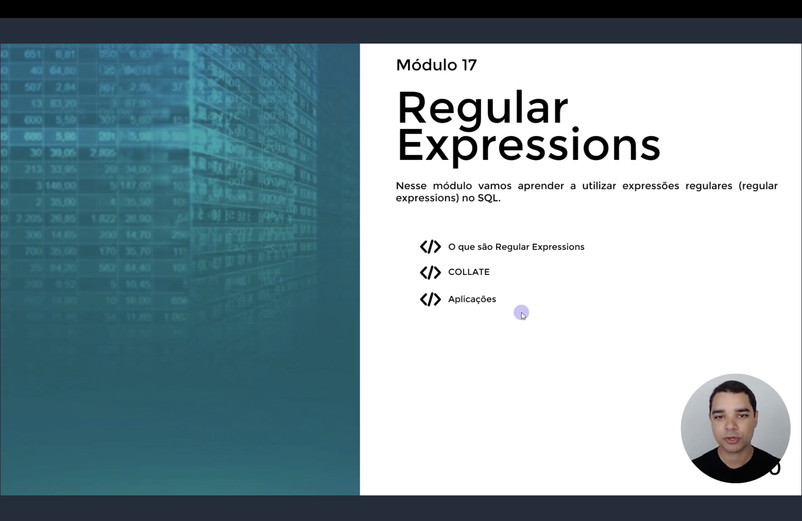
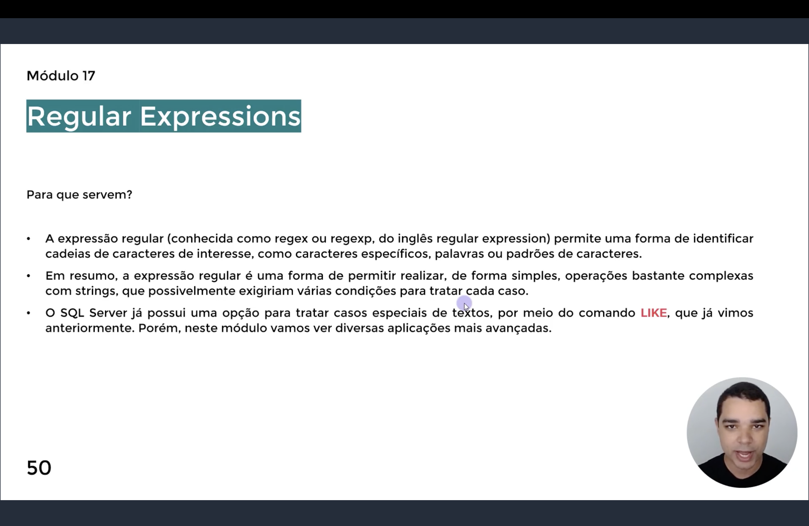
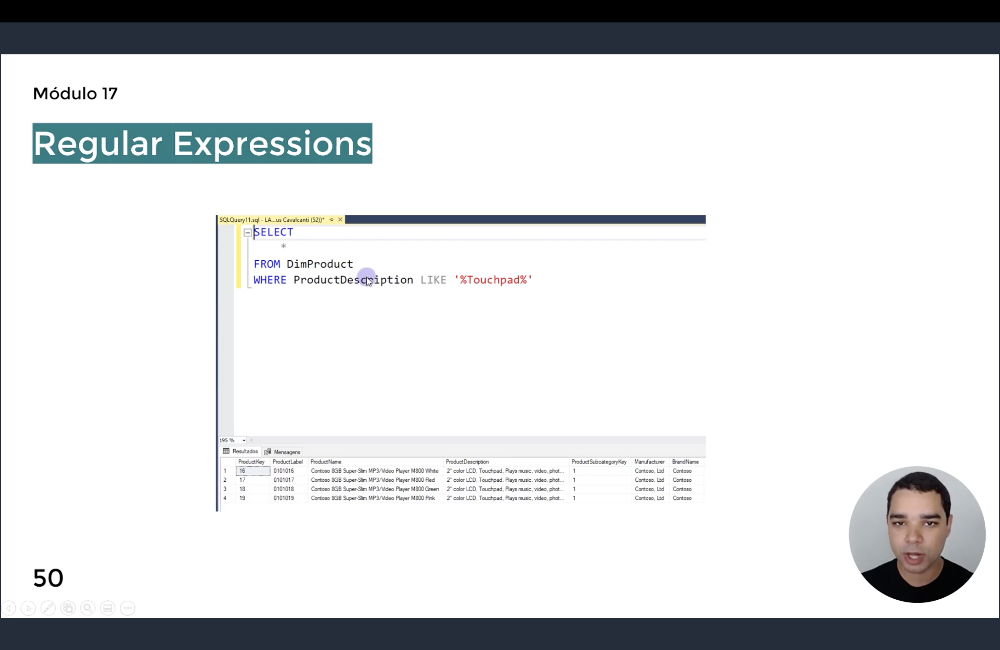
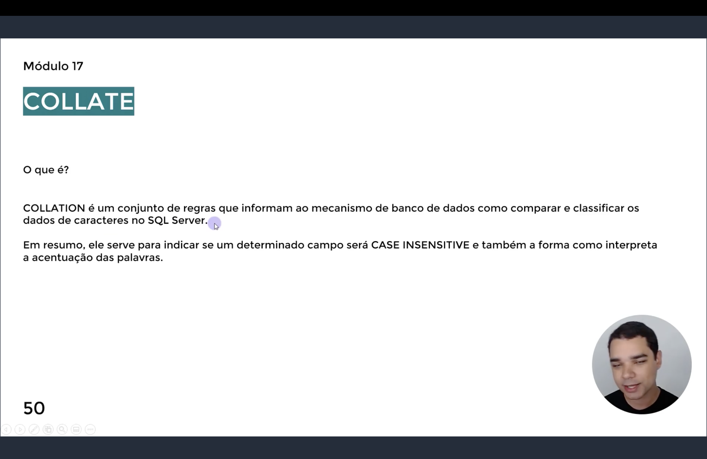
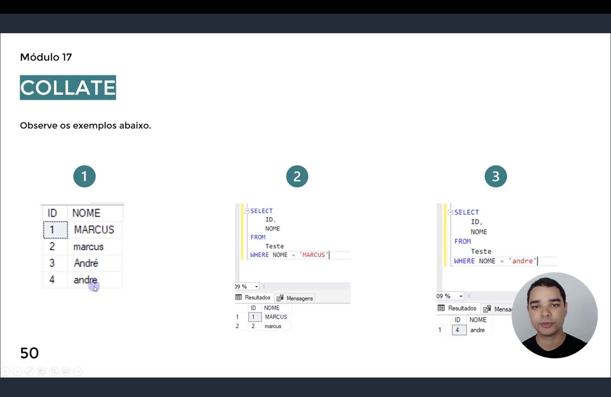
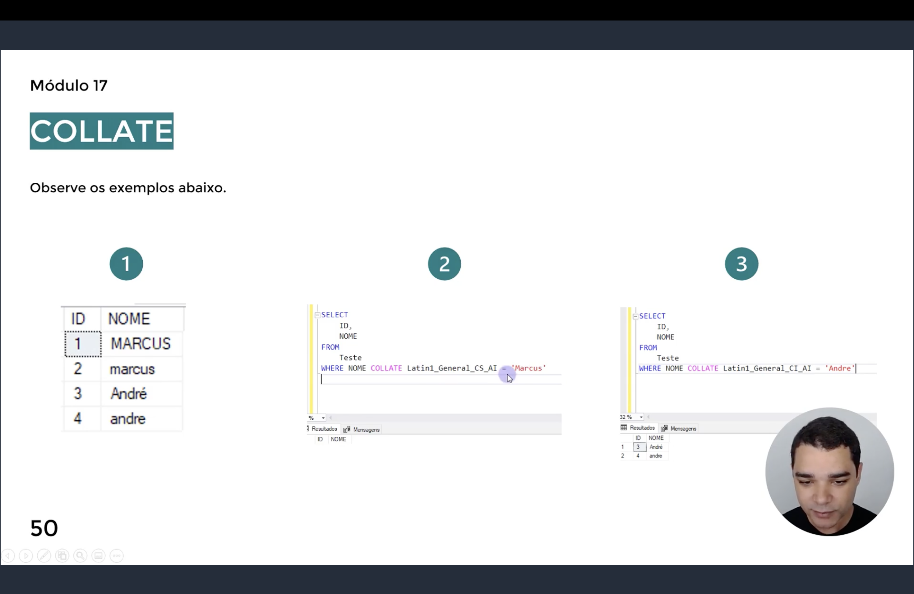
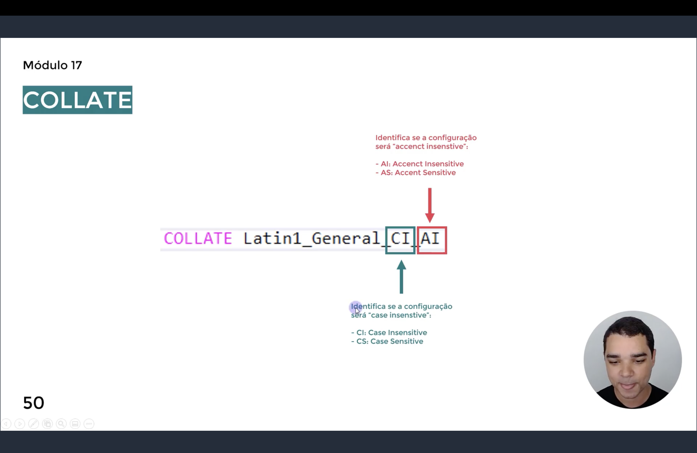

<h1 align="center">
  🔤 Regex — Regular Expressions <br>
  
</h1>

<p align="center">
  
  
  
</p>

> 📌 Nos slides de abertura o instrutor numera este conteúdo como **"Módulo 17"**, mas ele corresponde
> à pasta `Módulo 16` deste repositório — a numeração interna do curso está um módulo à frente da
> organização das pastas.

<p align="center">
  
</p>

<p align="center">
  <em>Slide de abertura do módulo: <strong>Regular Expressions</strong>. O objetivo é aprender a
  utilizar expressões regulares no SQL, cobrindo três frentes — o que são Regular Expressions,
  COLLATE e Aplicações.</em>
</p>

<h2 align="center">💡 O que são Regular Expressions? <br>
</h2>

<p align="center">
  
</p>

**Para que servem:**

- **Expressão regular** (conhecida como *regex* ou *regexp*, do inglês *regular expression*) é uma
  forma de identificar **cadeias de caracteres de interesse** — caracteres específicos, palavras ou
  padrões de caracteres;
- Em resumo, permitem realizar, **de forma simples**, operações bastante complexas com strings, que
  de outro modo exigiriam várias condições para tratar cada caso;
- O SQL Server já possui uma opção para tratar casos especiais de texto por meio do comando **`LIKE`**
  — que já é conhecido de módulos anteriores — mas neste módulo são vistas **aplicações mais
  avançadas** desse comando.

<h3 align="center">Relembrando o LIKE</h3>

<p align="center">
  
</p>

```sql
SELECT *
FROM DimProduct
WHERE ProductDescription LIKE '%Touchpad%'
```

O `%` é o curinga mais básico do `LIKE`: ele casa **qualquer sequência de caracteres** antes e/ou
depois do trecho procurado. Aqui, a busca retorna todos os produtos cuja descrição contenha a palavra
`Touchpad` em qualquer posição.

> 💬 É a partir desse comando já conhecido que o módulo evolui para padrões bem mais ricos, usando
> classes de caracteres (`[ ]`), intervalos (`[A-z]`), negação (`[^...]`) e o `COLLATE` para controlar
> sensibilidade a maiúsculas/minúsculas e acentos.

<h2 align="center">🔠 COLLATE <br>
</h2>

<p align="center">
  
</p>

**O que é:**

> `COLLATION` é um **conjunto de regras** que informam ao mecanismo do banco de dados como comparar e
> classificar dados de caracteres no SQL Server. Em resumo, ele indica se um campo será **CASE
> INSENSITIVE** e como a acentuação das palavras é interpretada nas comparações.

O `COLLATION` pode ser definido em **três níveis** diferentes:

| # | Nível | Como é definido |
|---|-------|------------------|
| 1 | **SQL Server** | Definido na instalação do programa. Padrão: `Latin1_General_CI_AS` |
| 2 | **Banco de Dados** | Herda o do SQL Server por padrão; pode ser definido no `CREATE DATABASE` ou alterado depois com `ALTER DATABASE` |
| 3 | **Tabela/Coluna** | Colunas `VARCHAR` herdam o do banco por padrão; pode ser sobrescrito na definição da coluna com `COLLATE` |

```sql
-- 1) Descobrindo o COLLATION a nível de SQL Server
SELECT SERVERPROPERTY('collation')

-- 2) Definindo o COLLATION na criação de um Banco de Dados
CREATE DATABASE BD_Collation
COLLATE Latin1_General_CS_AS

-- Alterando o COLLATE de um banco já existente
ALTER DATABASE BD_Collation COLLATE Latin1_General_CI_AS

-- Consultando o COLLATION configurado de um Banco específico
SELECT DATABASEPROPERTYEX('BD_Collation', 'collation')

-- 3) Definindo o COLLATION de uma coluna específica na criação da tabela
CREATE TABLE Nomes(
    ID INT,
    Nome1 VARCHAR(100),
    Nome2 VARCHAR(100) COLLATE Latin1_General_CS_AS
)

-- Consultando o COLLATION de cada coluna da tabela
sp_help Nomes
```

> 💡 `Latin1_General_CI_AS` é o padrão de fábrica do SQL Server: **CI** (Case Insensitive) não
> diferencia maiúsculas de minúsculas, e **AS** (Accent Sensitive) diferencia palavras acentuadas de
> não acentuadas.

<h3 align="center">Exemplo — comportamento padrão (CI_AS)</h3>

<p align="center">
  
</p>

Considerando a tabela `Teste` abaixo:

| ID | NOME |
|----|--------|
| 1 | MARCUS |
| 2 | marcus |
| 3 | André |
| 4 | andre |

```sql
-- Coluna com o COLLATION padrão (CI_AS)
SELECT ID, NOME FROM Teste WHERE NOME = 'MARCUS'
```

Como o padrão é **Case Insensitive**, a busca por `'MARCUS'` retorna **as duas linhas** — `MARCUS` e
`marcus` — pois maiúsculas e minúsculas são tratadas como iguais.

```sql
SELECT ID, NOME FROM Teste WHERE NOME = 'andre'
```

Já como o padrão é **Accent Sensitive**, a busca por `'andre'` retorna **apenas** a linha 4
(`andre`) — a linha 3 (`André`) não é considerada igual, porque o acento importa.

<h3 align="center">Exemplo — sobrescrevendo o COLLATE na própria consulta</h3>

<p align="center">
  
</p>

O `COLLATE` também pode ser aplicado **diretamente em uma cláusula `WHERE`**, sobrescrevendo o
comportamento padrão da coluna só para aquela comparação:

```sql
-- Case Sensitive + Accent Insensitive
SELECT ID, NOME FROM Teste
WHERE NOME COLLATE Latin1_General_CS_AI = 'Marcus'
-- Não retorna nada: nem 'MARCUS' nem 'marcus' são iguais a 'Marcus' quando maiúsculas importam

-- Case Insensitive + Accent Insensitive
SELECT ID, NOME FROM Teste
WHERE NOME COLLATE Latin1_General_CI_AI = 'Andre'
-- Retorna 'André' (id 3) e 'andre' (id 4): nem caixa nem acento importam
```

<h3 align="center">Decodificando o nome do COLLATE</h3>

<p align="center">
  
</p>

```
COLLATE Latin1_General_CI_AI
                       └┬┘ └┬┘
                        │   └── Accent: AI = Accent Insensitive · AS = Accent Sensitive
                        └────── Case:   CI = Case Insensitive   · CS = Case Sensitive
```

| Sufixo | Significado |
|--------|-------------|
| `CI` | **Case Insensitive** — não diferencia maiúsculas de minúsculas |
| `CS` | **Case Sensitive** — diferencia maiúsculas de minúsculas |
| `AI` | **Accent Insensitive** — não diferencia palavras acentuadas |
| `AS` | **Accent Sensitive** — diferencia palavras acentuadas |

<h2 align="center">🧩 LIKE + COLLATE Case Sensitive: classes de caracteres <br>
</h2>

Com uma coluna `COLLATE ..._CS_AS` (Case Sensitive), o `LIKE` passa a **diferenciar maiúsculas de
minúsculas**, o que abre espaço para padrões bem mais precisos usando colchetes `[ ]`:

```sql
CREATE TABLE Nomes(
    ID INT,
    Nome VARCHAR(100) COLLATE SQL_Latin1_General_CP1_CS_AS
)

INSERT INTO Nomes(ID, Nome) VALUES
    (1,'Matheus'), (2,'Marcela'), (3,'marcos'), (4,'MAuricio'), (5,'Marta'),
    (6,'Miranda'), (7,'Melissa'), (8,'Lucas'), (9,'luisa'), (10,'Pedro')

-- LIKE padrão (sem classes de caracteres)
SELECT * FROM Nomes WHERE Nome LIKE 'mar%'

-- [m][a][r]%  -> 1ª letra 'm', 2ª 'a', 3ª 'r' (minúsculas exatas)
SELECT * FROM Nomes WHERE Nome LIKE '[m][a][r]%'

-- [M][a][r]%  -> 1ª letra 'M' maiúscula, 2ª 'a', 3ª 'r'
SELECT * FROM Nomes WHERE Nome LIKE '[M][a][r]%'

-- [M-m][A-a]% -> 1ª letra 'M' ou 'm', 2ª 'A' ou 'a' (intervalo dentro dos colchetes)
SELECT * FROM Nomes WHERE Nome LIKE '[M-m][A-a]%'
```

> 💡 Dentro de `[ ]`, cada posição pode listar **caracteres específicos** (`[m]`, `[MEK]`) ou um
> **intervalo** (`[A-z]`, `[0-9]`). Cada par de colchetes representa **exatamente uma posição** no
> texto.

<h3 align="center">Filtrando pelos primeiros caracteres + quantidade de caracteres</h3>

```sql
CREATE TABLE Textos(
    ID INT,
    Texto VARCHAR(100) COLLATE SQL_Latin1_General_CP1_CS_AS
)

INSERT INTO Textos(ID, Texto) VALUES
    (1,'Marcos'), (2,'Excel'), (3,'leandro'), (4,'K'), (5,'X7'),
    (6,'l9'), (7,'#M'), (8,'@9'), (9,'M'), (10,'RT')

-- Começa com 'M', 'E' ou 'K'
SELECT * FROM Textos WHERE Texto LIKE '[MEK]%'

-- Possui exatamente 1 caractere (letra)
SELECT * FROM Textos WHERE Texto LIKE '[A-z]'

-- Possui exatamente 2 caracteres (ambos letras)
SELECT * FROM Textos WHERE Texto LIKE '[A-z][A-z]'

-- Possui exatamente 2 caracteres: 1ª uma letra, 2ª um número
SELECT * FROM Textos WHERE Texto LIKE '[A-z][0-9]'
```

> 📌 Sem `%` no início/fim, o `LIKE` casa a **string inteira** — por isso `'[A-z]'` só retorna textos
> de **um único caractere**, e `'[A-z][A-z]'` só os de **dois**.

<h3 align="center">Combinando curinga `_`, classes e `%`</h3>

```sql
CREATE TABLE Nomes(
    ID INT,
    Nome VARCHAR(100) COLLATE SQL_Latin1_General_CP1_CS_AS
)

INSERT INTO Nomes(ID, Nome) VALUES
    (1,'Matheus'), (2,'Marcela'), (3,'marcos'), (4,'MAuricio'), (5,'Marta'),
    (6,'Miranda'), (7,'Melissa'), (8,'Lucas'), (9,'luisa'), (10,'Pedro')

-- 1) Começa com 'M' ou 'm'
-- 2) 2º caractere é qualquer um ('_' é curinga de exatamente 1 caractere)
-- 3) 3º caractere é 'R' ou 'r'
-- 4) Qualquer quantidade de caracteres depois (por causa do '%')
SELECT * FROM Nomes WHERE Nome LIKE '[Mm]_[Rr]%'
```

<h3 align="center">Negação com `^`</h3>

```sql
-- Nomes que NÃO começam com 'L' ou 'l'
SELECT * FROM Nomes WHERE Nome LIKE '[^Ll]%'

-- Nomes cujo 2º caractere NÃO é 'E' ou 'e' (1º caractere é qualquer um, via '_')
SELECT * FROM Nomes WHERE Nome LIKE '_[^Ee]%'
```

> 💡 O `^` como **primeiro símbolo dentro dos colchetes** inverte a classe: `[^Ll]` significa "qualquer
> caractere que **não** seja L nem l".

<h3 align="center">Identificando caracteres especiais</h3>

```sql
CREATE TABLE Textos(
    ID INT,
    Texto VARCHAR(100) COLLATE SQL_Latin1_General_CP1_CS_AS
)

INSERT INTO Textos(ID, Texto) VALUES
    (1,'Marcos'), (2,'Excel'), (3,'leandro'), (4,'K'), (5,'X7'),
    (6,'l9'), (7,'#M'), (8,'@9'), (9,'M'), (10,'RT')

-- Textos que contêm algum caractere que NÃO é letra nem número
SELECT * FROM Textos WHERE Texto LIKE '%[^A-z0-9]%'
```

<h3 align="center">Aplicações com números</h3>

```sql
CREATE TABLE Numeros(Numero DECIMAL(20,2))

INSERT INTO Numeros(Numero) VALUES
    (50), (30.23), (9), (100.54), (15.9), (6.5), (10), (501.76), (1000.56), (31)

-- Números com exatamente 2 dígitos na parte inteira e ',00' na parte decimal
SELECT * FROM Numeros WHERE Numero LIKE '[0-9][0-9].[0][0]'

-- Números com:
-- 1) 3 dígitos na parte inteira, sendo o 1º igual a 5
-- 2) 1º dígito decimal igual a 7
-- 3) 2º dígito decimal qualquer (0 a 9)
SELECT * FROM Numeros WHERE Numero LIKE '[5]__.[7][0-9]'
```

> 📌 Como `Numero` é `DECIMAL`, o `LIKE` funciona porque o SQL Server converte implicitamente o valor
> para texto antes de comparar com o padrão.

<h2 align="center">📋 Resumo <br>
</h2>

| Sintaxe | O que faz |
|---------|-----------|
| `COLLATE <nome>` | Define/sobrescreve a regra de comparação de texto (nível servidor, banco, coluna ou até na própria consulta) |
| `..._CI_AS` (padrão SQL Server) | Ignora maiúsculas/minúsculas, mas diferencia acentos |
| `..._CS_AI` | Diferencia maiúsculas/minúsculas, mas ignora acentos |
| `LIKE '%texto%'` | Curinga clássico — casa qualquer sequência antes/depois |
| `LIKE '[abc]'` | Casa **um** caractere dentre os listados |
| `LIKE '[A-z]'` / `'[0-9]'` | Casa **um** caractere dentro do intervalo |
| `LIKE '[^abc]'` | Casa **um** caractere que **não** esteja entre os listados |
| `LIKE '_'` | Casa exatamente **um** caractere qualquer |

<h2 align="center">🗄️ Conteúdo do Módulo <br>
</h2>

| Tópico | Status |
|--------|--------|
| O que são Regular Expressions | ✅ Introduzido |
| COLLATE (SQL Server, Banco de Dados, Tabela/Coluna) | ✅ Concluído |
| `LIKE` com classes de caracteres, intervalos e negação (`[ ]`, `[^ ]`, `_`) | ✅ Concluído |
| Aplicações do `LIKE` com números | ✅ Concluído |
