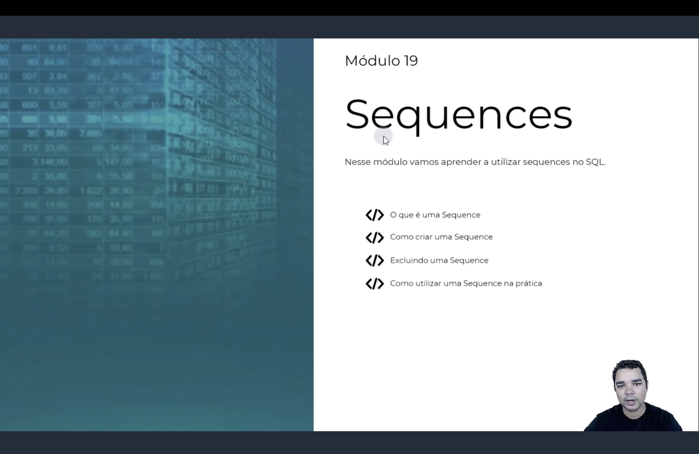

<h1 align="center">
  🔢 Sequences <br>
   <br>
  
</h1>

<p align="center">
  
  
  
</p>

> 📌 Seguindo o padrão dos módulos anteriores, nos slides de abertura o instrutor deve numerar este
> conteúdo como **"Módulo 19"**, correspondendo à pasta `Módulo 18` deste repositório.

> 🖼️ Este módulo ainda não tem screenshots das aulas na pasta `img/` — assim que forem adicionados,
> as tags `` correspondentes entram nas seções abaixo.

<h2 align="center">💡 O que é uma Sequence? <br>
</h2>

**Para que serve:**

- Já conhecemos o `IDENTITY`, que gera valores automáticos e sequenciais, mas **preso a uma única
  coluna de uma única tabela**;
- A **`SEQUENCE`** é um objeto do banco, **independente de qualquer tabela**, que gera uma sequência de
  números — o mesmo objeto pode ser compartilhado por várias tabelas e colunas diferentes.

<h2 align="center">⚖️ Sequence vs IDENTITY <br>
</h2>

| Característica | `IDENTITY` | `SEQUENCE` |
|-----------------|------------|------------|
| Onde vive | Dentro de uma coluna | Objeto independente do banco |
| Compartilhável entre tabelas | Não | Sim |
| Pode gerar o próximo valor sem inserir | Difícil | Sim (`NEXT VALUE FOR`) |
| Reiniciar/reconfigurar depois | Limitado | `ALTER SEQUENCE` completo |
| Suporta ciclo (voltar ao início) | Não | Sim (`CYCLE`) |

<h2 align="center">🏗️ Criando uma Sequence <br>
</h2>

```sql
CREATE SEQUENCE Seq_CodigoProduto
    AS INT
    START WITH 1000
    INCREMENT BY 10
    MINVALUE 1000
    MAXVALUE 99999
    NO CYCLE
```

| Opção | O que faz |
|-------|-----------|
| `AS tipo` | Tipo de dado da sequência (padrão: `BIGINT`) |
| `START WITH` | Valor inicial |
| `INCREMENT BY` | Quanto cada `NEXT VALUE FOR` soma (aceita negativo, gerando sequência decrescente) |
| `MINVALUE` / `MAXVALUE` | Limites da sequência |
| `CYCLE` / `NO CYCLE` | Se, ao atingir o limite, a sequência volta ao início |
| `CACHE` / `NO CACHE` | Quantos valores o SQL Server pré-gera em memória, para performance |

<h2 align="center">🚀 Usando uma Sequence <br>
</h2>

```sql
-- Como DEFAULT de uma coluna
CREATE TABLE Pedido(
    ID_Pedido INT PRIMARY KEY DEFAULT (NEXT VALUE FOR Seq_Pedido),
    Descricao VARCHAR(100)
)

INSERT INTO Pedido(Descricao) VALUES ('Pedido A')

-- Explicitamente dentro do INSERT
INSERT INTO Produto(Codigo, Nome)
VALUES (NEXT VALUE FOR Seq_CodigoProduto, 'Teclado')

-- Reiniciando a sequência
ALTER SEQUENCE Seq_Pedido RESTART WITH 1
```

> 💡 Para reservar vários valores de uma vez (sem gastar um a um a cada chamada), existe a procedure
> `sp_sequence_get_range`, útil quando uma aplicação precisa de vários IDs antes de gravar no banco.

<h2 align="center">📋 Resumo <br>
</h2>

| Sintaxe | O que faz |
|---------|-----------|
| `CREATE SEQUENCE nome ...` | Cria um objeto de sequência independente de tabela |
| `NEXT VALUE FOR nome` | Retorna o próximo valor da sequência |
| `ALTER SEQUENCE nome RESTART WITH valor` | Reinicia a sequência a partir de um valor |
| `sp_sequence_get_range` | Reserva um intervalo de valores de uma só vez |
| `sys.sequences` | View de sistema com metadados de todas as sequences do banco |

<h2 align="center">🗄️ Conteúdo do Módulo <br>
</h2>

| Tópico | Status |
|--------|--------|
| O que é uma Sequence (e comparação com IDENTITY) | ✅ Concluído |
| Como criar uma Sequence (`CREATE SEQUENCE`) | ✅ Concluído |
| Como utilizar uma Sequence (`NEXT VALUE FOR`, `ALTER SEQUENCE`) | ✅ Concluído |
| Exercícios | ⏳ Pendente (aguardando enunciado) |
