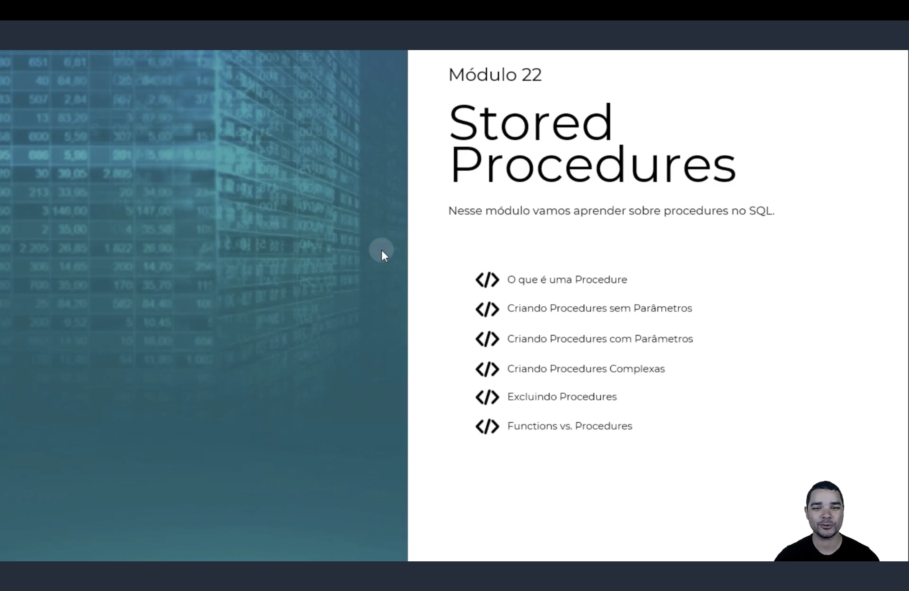

<h1 align="center">
  ⚙️ Procedures <br>
   <br>
  
</h1>

<p align="center">
  
  
  
</p>

> 📌 Seguindo o padrão dos módulos anteriores, nos slides de abertura o instrutor deve numerar este
> conteúdo como **"Módulo 22"**, correspondendo à pasta `Módulo 21` deste repositório.

> 🖼️ Este módulo ainda não tem screenshots das aulas na pasta `img/` — assim que forem adicionados,
> as tags `` correspondentes entram nas seções abaixo.

<h2 align="center">💡 O que é uma Procedure? <br>
</h2>

**Para que serve:**

- Uma **Stored Procedure** é um bloco de comandos T-SQL salvo no banco, com nome, executado sob
  demanda com `EXEC`;
- Pode rodar `SELECT`, `INSERT`, `UPDATE`, `DELETE`, controlar transações e devolver múltiplos
  resultados — muito mais liberdade que uma Function;
- Vantagens: reutilização de lógica, plano de execução compilado e reaproveitado (performance), e
  possibilidade de liberar acesso à procedure sem liberar acesso direto às tabelas.

```sql
CREATE PROCEDURE nome_da_procedure
    @parametro1 tipo,
    @parametro2 tipo = valor_default
AS
BEGIN
    -- comandos T-SQL
END

EXEC nome_da_procedure @parametro1 = valor
```

<h2 align="center">🧩 Parâmetros: nenhum, um, vários e com DEFAULT <br>
</h2>

```sql
-- Sem parâmetros
CREATE PROCEDURE sp_ListarContratosAtivos
AS
BEGIN
    SELECT * FROM fContratos WHERE Status = 'Ativo'
END

-- Vários parâmetros + parâmetro com valor DEFAULT (opcional)
CREATE PROCEDURE sp_ContratosPorStatus
    @Status VARCHAR(20) = 'Ativo'
AS
BEGIN
    SELECT * FROM fContratos WHERE Status = @Status
END

EXEC sp_ContratosPorStatus              -- usa o DEFAULT
EXEC sp_ContratosPorStatus @Status = 'Cancelado'
```

> 💬 Chamando de forma **nomeada** (`@parametro = valor`), a ordem dos parâmetros deixa de importar.

<h2 align="center">🏗️ Procedure completa: cadastro de contrato <br>
</h2>

Uma Procedure combina tudo visto até aqui — parâmetros, variáveis locais, `IF/ELSE`, `TRANSACTION` e
`TRY/CATCH` — em um único objeto reutilizável:

```sql
CREATE PROCEDURE sp_CadastrarContrato
    @NomeCliente   VARCHAR(100),
    @CPFCliente    CHAR(11),
    @ID_Gerente    INT,
    @ValorContrato DECIMAL(10,2)
AS
BEGIN
    DECLARE @ID_Cliente INT

    BEGIN TRY
        BEGIN TRAN
            IF NOT EXISTS (SELECT 1 FROM dGerente WHERE ID_Gerente = @ID_Gerente)
                RAISERROR('Gerente informado não existe', 16, 1)

            SELECT @ID_Cliente = ID_Cliente FROM dCliente WHERE CPF = @CPFCliente

            IF @ID_Cliente IS NULL
            BEGIN
                INSERT INTO dCliente(Nome, CPF) VALUES (@NomeCliente, @CPFCliente)
                SET @ID_Cliente = SCOPE_IDENTITY()
            END

            INSERT INTO fContratos(ID_Cliente, ID_Gerente, ValorContrato)
            VALUES (@ID_Cliente, @ID_Gerente, @ValorContrato)
        COMMIT
    END TRY
    BEGIN CATCH
        IF @@TRANCOUNT > 0
            ROLLBACK

        PRINT 'Erro ao cadastrar contrato: ' + ERROR_MESSAGE()
    END CATCH
END
```

> 💡 `SCOPE_IDENTITY()` devolve o último `IDENTITY` gerado na mesma sessão e no mesmo escopo — mais
> seguro que `@@IDENTITY`, que pode capturar o `IDENTITY` de uma trigger disparada por engano.

<h2 align="center">🗑️ Excluindo uma Procedure <br>
</h2>

```sql
-- Falha se a procedure não existir
DROP PROCEDURE sp_ContratosPorStatus

-- Forma segura e direta (SQL Server 2016+)
DROP PROCEDURE IF EXISTS sp_ContratosPorCliente
```

<h2 align="center">⚖️ Functions vs Procedures <br>
</h2>

| Característica | `FUNCTION` | `PROCEDURE` |
|------------------|------------|-------------|
| Precisa devolver valor com `RETURN` | Sim, obrigatório | Não |
| Pode executar `INSERT`/`UPDATE`/`DELETE` | Não | Sim |
| Pode ser usada dentro de `SELECT`/`WHERE` | Sim | Não |
| Pode controlar transações | Não | Sim |
| Pode devolver múltiplos result sets | Não | Sim |
| Pode ter parâmetros `OUTPUT` | Não | Sim |
| Forma de chamar | `dbo.nome(args)` | `EXEC nome args` |

```sql
CREATE PROCEDURE sp_ContarContratosDoCliente
    @ID_Cliente INT,
    @Total      INT OUTPUT
AS
BEGIN
    SELECT @Total = COUNT(*) FROM fContratos WHERE ID_Cliente = @ID_Cliente
END

DECLARE @QuantidadeContratos INT
EXEC sp_ContarContratosDoCliente @ID_Cliente = 1, @Total = @QuantidadeContratos OUTPUT
```

<h2 align="center">📋 Resumo <br>
</h2>

| Sintaxe | O que faz |
|---------|-----------|
| `CREATE PROCEDURE nome ... AS BEGIN ... END` | Cria uma procedure |
| `EXEC nome @parametro = valor` | Executa a procedure |
| `@parametro tipo = valor` | Parâmetro com valor `DEFAULT` (opcional) |
| `@parametro tipo OUTPUT` | Parâmetro de saída |
| `DROP PROCEDURE IF EXISTS nome` | Remove a procedure, sem erro se ela não existir |
| `sys.procedures` | Consulta as procedures existentes no banco |

<h2 align="center">🗄️ Conteúdo do Módulo <br>
</h2>

| Tópico | Status |
|--------|--------|
| O que é uma Procedure | ✅ Concluído |
| Procedure sem parâmetros, com 1 e com vários parâmetros | ✅ Concluído |
| Parâmetro com valor DEFAULT | ✅ Concluído |
| Procedure completa: cadastro de contrato (transação + validações) | ✅ Concluído |
| Excluindo uma Procedure | ✅ Concluído |
| Functions vs Procedures | ✅ Concluído |
| Exercícios | ⏳ Pendente (aguardando enunciado) |
