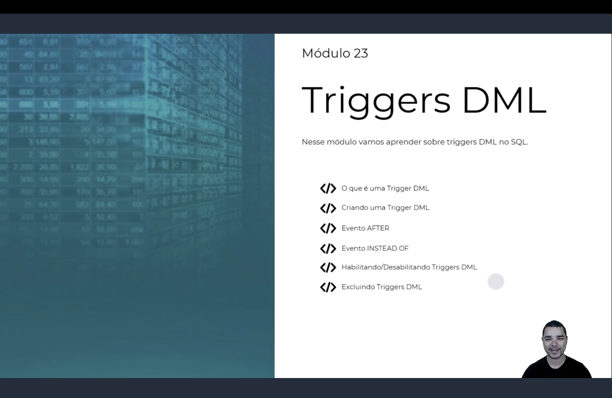

<h1 align="center">
  ⚡ Triggers DML <br>
   <br>
  
</h1>

<p align="center">
  
  
  
</p>

> 📌 Seguindo o padrão dos módulos anteriores, nos slides de abertura o instrutor deve numerar este
> conteúdo como **"Módulo 23"**, correspondendo à pasta `Módulo 22` deste repositório.

> 🖼️ Este módulo ainda não tem screenshots das aulas na pasta `img/` — assim que forem adicionados,
> as tags `` correspondentes entram nas seções abaixo.

<h2 align="center">💡 O que é uma Trigger DML? <br>
</h2>

**Para que serve:**

- Uma **Trigger** é um bloco T-SQL executado **automaticamente** pelo SQL Server, em reação a um
  evento — sem ser chamada explicitamente como uma Procedure;
- Uma **Trigger DML** dispara em reação a `INSERT`, `UPDATE` e/ou `DELETE`.

| Tipo | Quando dispara | Uso típico |
|------|-----------------|------------|
| `AFTER` (ou `FOR`) | **Depois** que o comando já foi executado na tabela | Auditoria, notificações, validações que cancelam com `ROLLBACK` |
| `INSTEAD OF` | **No lugar** do comando original — o comando do usuário não acontece sozinho | Regras de negócio restritivas, escrita em views complexas |

```sql
CREATE TRIGGER nome_da_trigger
ON tabela
AFTER INSERT, UPDATE, DELETE      
-- ou: INSTEAD OF INSERT, UPDATE, DELETE
AS
BEGIN
    -- comandos SQL
END
```

<h2 align="center">📝 Criando uma Trigger AFTER <br>
</h2>

```sql
CREATE TRIGGER trg_Produto_AfterInsert
ON Produto
AFTER INSERT
AS
BEGIN
    INSERT INTO ProdutoLog(ID_Produto, Operacao)
    SELECT ID_Produto, 'INSERT'
    FROM inserted
END
```

<h2 align="center">🪄 As tabelas mágicas inserted e deleted <br>
</h2>

Dentro de qualquer trigger DML, o SQL Server disponibiliza duas tabelas temporárias com a mesma
estrutura da tabela monitorada:

| Evento | `inserted` | `deleted` |
|--------|------------|-----------|
| `INSERT` | Linhas novas | Vazia |
| `UPDATE` | Valores **depois** da alteração | Valores **antes** da alteração |
| `DELETE` | Vazia | Linhas removidas |

> 💬 Um `UPDATE` popula as **duas** tabelas ao mesmo tempo: `deleted` com o "antes" e `inserted` com
> o "depois".

<h2 align="center">🔎 Identificando o evento dentro da Trigger <br>
</h2>

Quando uma trigger reage a vários eventos, dá para descobrir qual disparou combinando a presença de
linhas em `inserted`/`deleted`:

```sql
IF EXISTS (SELECT 1 FROM inserted) AND EXISTS (SELECT 1 FROM deleted)
    SET @Operacao = 'UPDATE'
ELSE IF EXISTS (SELECT 1 FROM inserted)
    SET @Operacao = 'INSERT'
ELSE
    SET @Operacao = 'DELETE'
```

<h2 align="center">🔐 Trigger INSTEAD OF: controle de permissão de cadastro <br>
</h2>

Cenário: um `Funcionario` só pode ser cadastrado se um **código de autorização** válido do RH for
informado junto com o `INSERT` — mas esse código não deve ficar salvo na tabela. Uma trigger
`INSTEAD OF INSERT` intercepta a tentativa e decide o que realmente acontece:

```sql
CREATE TRIGGER trg_Funcionario_ValidarAutorizacao
ON Funcionario
INSTEAD OF INSERT
AS
BEGIN
    IF EXISTS 
    (
        SELECT 1 FROM inserted i
        WHERE NOT EXISTS 
        (
            SELECT 1 FROM CodigosAutorizacaoRH c WHERE c.Codigo = i.CodigoAutorizacao
        )
    )
    BEGIN
        RAISERROR('Código de autorização inválido - cadastro bloqueado', 16, 1)
        RETURN
    END

    INSERT INTO Funcionario(Nome, Salario, CodigoAutorizacao)
    SELECT Nome, Salario, NULL
    FROM inserted
END
```

> 📌 Como é `INSTEAD OF`, o `INSERT` original **nunca** acontece sozinho — a trigger que decide (e
> executa) o que de fato é gravado na tabela.

<h2 align="center">🛠️ Habilitando, Desabilitando e Excluindo <br>
</h2>

```sql
DISABLE TRIGGER trg_Produto_Log ON Produto  
-- desliga temporariamente
ENABLE TRIGGER trg_Produto_Log ON Produto   
-- liga de novo
DROP TRIGGER trg_Produto_Log                
-- remove definitivamente

-- Consultando as triggers do banco e seu status
SELECT name, is_instead_of_trigger, is_disabled FROM sys.triggers;
```

<h2 align="center">📋 Resumo <br>
</h2>

| Sintaxe | O que faz |
|---------|-----------|
| `CREATE TRIGGER nome ON tabela AFTER evento(s) AS ...` | Dispara depois do comando já executado |
| `CREATE TRIGGER nome ON tabela INSTEAD OF evento(s) AS ...` | Substitui completamente o comando original |
| `inserted` | Linhas novas (INSERT) / valores depois (UPDATE) |
| `deleted` | Linhas removidas (DELETE) / valores antes (UPDATE) |
| `DISABLE/ENABLE TRIGGER nome ON tabela` | Desliga/liga a trigger sem excluí-la |
| `DROP TRIGGER nome` | Remove a trigger definitivamente |
| `sys.triggers` | Consulta as triggers existentes e seu status |

<h2 align="center">🗄️ Conteúdo do Módulo <br>
</h2>

| Tópico | Status |
|--------|--------|
| O que é uma Trigger DML (AFTER vs INSTEAD OF) | ✅ Concluído |
| Criando uma Trigger AFTER | ✅ Concluído |
| Tabelas INSERTED e DELETED | ✅ Concluído |
| Identificando o evento DML relacionado | ✅ Concluído |
| Trigger INSTEAD OF para controle de permissão de cadastro | ✅ Concluído |
| Habilitando, Desabilitando e Excluindo uma Trigger | ✅ Concluído |