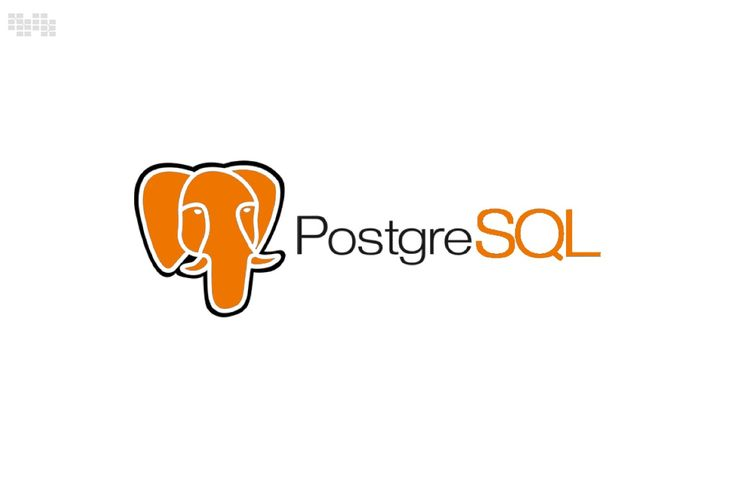
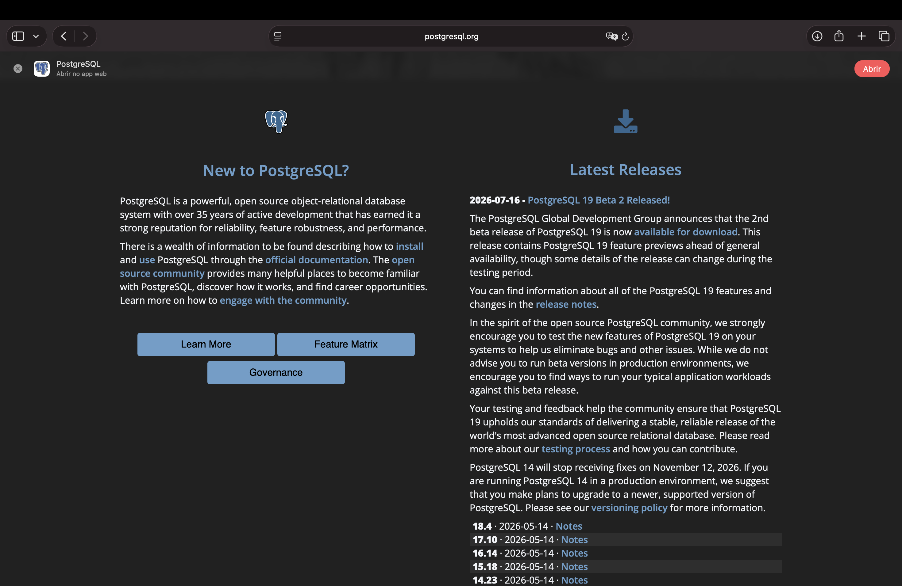

<h1 align="center">
  🐘 Introdução ao PostgreSQL <br>
   <br>
  
</h1>

<p align="center">
  
  
  
</p>

> 📌 Este é o primeiro módulo do curso fora do SQL Server. A partir daqui o banco de estudo passa a
> ser o **PostgreSQL**, e o banco de dados de exemplo passa a ser o **Northwind** — usado nos
> próximos módulos no lugar dos bancos avulsos criados a cada módulo do SQL Server.

<h2 align="center">🐘 O que é o PostgreSQL? <br>
</h2>

- É um **SGBD relacional open source**, gratuito, mantido por uma comunidade global há mais de 35 anos;
- É classificado como **objeto-relacional**: além das tabelas e tipos tradicionais de um banco relacional, permite criar tipos de dados customizados, herança de tabelas e funções mais próximas de uma linguagem de programação completa;
- A linguagem base continua sendo o **SQL padrão** (`SELECT`, `FROM`, `WHERE`, `JOIN`, `GROUP BY`...) — o que muda são detalhes de sintaxe e o "dialeto" procedural, chamado **PL/pgSQL** (equivalente ao T-SQL do SQL Server).

<h2 align="center">🏢 Onde o PostgreSQL é normalmente usado? <br>
</h2>

- **Startups e produtos SaaS** — por ser gratuito e não depender de licenciamento por servidor/núcleo;
- **Big techs e empresas de tecnologia** (ex.: Instagram, Spotify, Apple), em sistemas de alto volume de dados;
- **Aplicações que precisam de tipos de dados avançados**, como `JSONB` (dados semiestruturados), dados geográficos (extensão `PostGIS`) e buscas full-text nativas;
- **Ambientes cloud-native**, já que é o banco relacional padrão (ou um dos principais) em serviços gerenciados como Amazon RDS/Aurora, Google Cloud SQL, Supabase, Azure Database for PostgreSQL e Heroku;
- Cenários onde o **custo de licença** do SQL Server (ou Oracle) é uma barreira, mas ainda se precisa de um banco relacional robusto, com transações ACID e suporte maduro.

<h2 align="center">🔀 Principais diferenças: SQL Server × PostgreSQL <br>
</h2>

| Aspecto | SQL Server 🔄 | PostgreSQL 🐘 |
|---|---|---|
| Licença | Proprietário (Microsoft), pago em produção | Open source, gratuito (licença PostgreSQL, estilo MIT) |
| Linguagem procedural | T-SQL | PL/pgSQL |
| Autoincremento | `IDENTITY(1,1)` | `SERIAL` / `GENERATED ALWAYS AS IDENTITY` |
| Limitar linhas | `TOP 10` | `LIMIT 10` |
| Data/hora atual | `GETDATE()` | `NOW()` / `CURRENT_DATE` |
| Concatenar texto | `+` | `\|\|` |
| Separador de comandos (batch) | `GO` | Não existe — usa apenas `;` |
| Nomes de identificadores | Case-insensitive por padrão | Case-sensitive quando usados entre aspas duplas `""` |
| Ferramenta gráfica oficial | SSMS (SQL Server Management Studio) | pgAdmin |
| Tipos de dados extras | `XML`, `HIERARCHYID` | `JSONB`, `ARRAY`, `HSTORE`, tipos geométricos nativos |

<h2 align="center">⚖️ Vantagens e desvantagens <br>
</h2>

**✅ Vantagens do PostgreSQL (em relação ao SQL Server):**

- Totalmente **gratuito e open source**, sem custo de licença mesmo em produção;
- Multiplataforma "de fábrica" — roda nativamente em Windows, Linux e macOS (SQL Server só ganhou suporte a Linux/containers mais recentemente);
- Suporte nativo mais rico a tipos semiestruturados (`JSONB`) e extensões (ex.: `PostGIS` para dados geográficos);
- Comunidade open source muito ativa, com atualizações frequentes e extensível por plugins/extensões;
- Muito usado como banco padrão em plataformas cloud modernas, o que facilita a empregabilidade em stacks atuais (startups, backend com Node/Python/Django, etc.).

**❌ Desvantagens do PostgreSQL (em relação ao SQL Server):**

- Ferramental gráfico (pgAdmin) é considerado, por muitos, menos polido e intuitivo que o SSMS;
- Suporte comercial oficial é mais limitado — depende de empresas terceiras ou da própria comunidade, enquanto o SQL Server tem suporte direto da Microsoft;
- Integração nativa com o ecossistema Microsoft (Excel, Power BI, .NET, Active Directory) é mais simples e "plug-and-play" no SQL Server;
- Em empresas que já usam Windows Server/Active Directory, administrar o SQL Server tende a ser mais direto (autenticação integrada, ferramentas de gestão já conhecidas pelo time de infra).

> 💡 Na prática, a escolha entre os dois raramente é sobre "qual é melhor" e sim sobre **o ecossistema
> em que o projeto já está inserido** e **o orçamento disponível para licenciamento**.

<h2 align="center">⬇️ Como baixar e testar <br>

</h2>

<p align="center">
  
</p>

1. Acesse **[postgresql.org/download](https://www.postgresql.org/download/)** e baixe o instalador correspondente ao seu sistema operacional (Windows, macOS ou Linux);
2. O instalador (EDB no Windows, Postgres.app no macOS) já traz junto:
   - O **servidor PostgreSQL** (o banco em si);
   - O **pgAdmin** — interface gráfica para administrar o banco, equivalente ao SSMS;
   - O **Stack Builder** — ferramentas extras, opcional;
3. Durante a instalação será pedido:
   - Uma **senha** para o superusuário `postgres`;
   - A **porta** do servidor (padrão `5432` — manter o padrão);
4. Ao finalizar, abra o pgAdmin e conecte no servidor local usando o usuário `postgres` e a senha definida na instalação;
5. Para confirmar que o servidor está no ar, rode numa Query Tool:

```sql
SELECT version();
```

6. Crie um banco de dados vazio pelo pgAdmin — ele será usado logo em seguida para criar as tabelas do banco **Northwind**, que passa a ser o banco de estudo do curso a partir deste módulo.

<h2 align="center">🗄️ Conteúdo do Módulo <br>
</h2>

| Tópico | Status |
|--------|--------|
| Introdução ao PostgreSQL (o que é, onde é usado, SQL Server × PostgreSQL) | ✅ Concluído |
| Instalação do PostgreSQL + pgAdmin | ✅ Concluído |
| Criando as tabelas do banco Northwind | ✅ Concluído |
