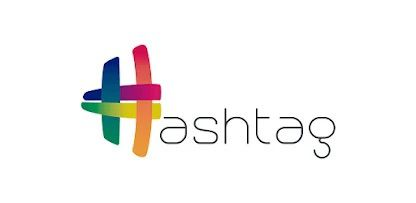

<h1 align="center">
  Hashtag Treinamentos -  
  SQL Impressionador
  
</h1>

  Repositório de estudos avançados em <strong>SQL</strong>, com foco em: modelagem de dados, consultas complexas, joins, subqueries, análise de dados, performance, integração com bancos relacionais e boas práticas profissionais. 🗄️📊  
    

<h2 align="center">👨🏻‍💻 Autor deste Repositório:</h2>

<strong>Lucas Paguetti Pereira</strong> 🧙‍♂️  
<strong>🏫 Instituição</strong>: Cesar School 🎓🧡  
📍 Recife, Pernambuco — <strong>Brazil</strong> 🇧🇷  

 

  
<a href="mailto:lpp2@cesar.school">
   
</a>
</a>

<h2 align="center">🌐 Hashtag Treinamentos:</h2>

<h2 align="center">🏛️ Arquitetura do Projeto:  

</h2>

<pre>
SQL - HashtagTreinamentos/
├── img/
│   └── Hashtag_logo.jpeg
│   └── Hashtag_logo2.jpeg
├── módulos/
│   └── módulo(1,2,3,4,5...)/
│       └── conteúdo e exercícios
├── README.md
└── LICENSE (MIT)
└── SQLtools/
        └── (MySQL, PostgreSQL e SQLite disponíveis)
</pre>

<h2 align="center">🎯 Objetivo do Repositório:</h2>

Este repositório tem como objetivo aprofundar os conhecimentos em <strong>SQL</strong>, capacitando para trabalhar com bancos de dados relacionais, criar consultas eficientes, analisar grandes volumes de dados e aplicar boas práticas utilizadas no mercado profissional 📈✅.

<h2 align="center">⛏️💻 Ferramentas Utilizadas:</h2>

    
  
  
  
  
  

